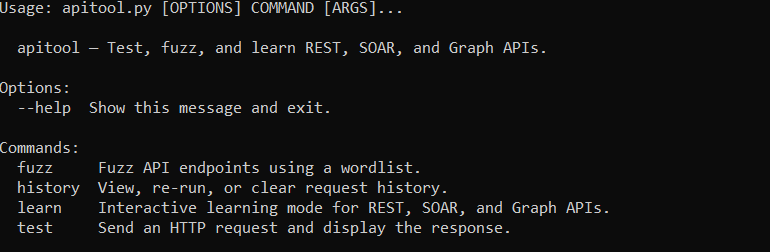

# apitool

A modular CLI for **API testing** and **interactive learning** — REST, SOAR, and Graph APIs.
Built for cybersecurity students and SOC analysts.

---
## Preview




---

## Installation

```bash
# 1. Clone / download the project
cd apitool

# 2. Create a virtual environment (recommended)
python3 -m venv venv
source venv/bin/activate        # Windows: venv\Scripts\activate

# 3. Install dependencies
pip install -r requirements.txt

# 4. (Optional) Make the script executable
chmod +x apitool.py
```

---

## Usage

Run with:

```bash
python apitool.py <subcommand> [options]
```

Or, after `chmod +x`:

```bash
./apitool.py <subcommand> [options]
```

---

## Subcommands

### `test` — Send an HTTP request

```bash
python apitool.py test \
  --url https://jsonplaceholder.typicode.com \
  --path /posts/1 \
  --method GET

# POST with body and custom header
python apitool.py test \
  --url https://httpbin.org/post \
  --method POST \
  --header "Content-Type=application/json" \
  --header "Authorization=Bearer mytoken" \
  --body '{"title":"Hello","body":"World"}' \
  --save                            # save to history
```

**Options:**

| Flag              | Short | Description                               |
|-------------------|-------|-------------------------------------------|
| `--url`           | `-u`  | Base URL (required)                       |
| `--path`          | `-p`  | Endpoint path, e.g. `/users/1`            |
| `--method`        | `-m`  | HTTP method (default: GET)                |
| `--header`        | `-H`  | Header as `key=value` (repeatable)        |
| `--body`          | `-b`  | JSON body string                          |
| `--timeout`       | `-t`  | Timeout in seconds (default: 10)          |
| `--save`          | `-s`  | Save result to history                    |

---

### `fuzz` — Enumerate API endpoints

```bash
python apitool.py fuzz \
  --url https://httpbin.org \
  --wordlist wordlists/common_api_paths.txt \
  --threads 10
```

**Options:**

| Flag          | Short | Description                            |
|---------------|-------|----------------------------------------|
| `--url`       | `-u`  | Base URL (required)                    |
| `--wordlist`  | `-w`  | Path to wordlist file (required)       |
| `--method`    | `-m`  | HTTP method (default: GET)             |
| `--threads`   | `-T`  | Concurrent threads (default: 5)        |
| `--timeout`   | `-t`  | Per-request timeout (default: 8s)      |

A sample wordlist is included at `wordlists/common_api_paths.txt`.

---

### `learn` — Interactive learning mode

```bash
# Show topic menu
python apitool.py learn

# Jump straight to a topic
python apitool.py learn --topic rest
python apitool.py learn --topic soar
python apitool.py learn --topic graph
```

Each module covers:
- **REST** — HTTP methods, status codes, statelessness, live GET exercise
- **SOAR** — What SOAR is, incident lifecycle, simulated API call
- **Graph** — GraphQL vs REST, schema/query/mutation, live GraphQL query

---

### `history` — View and re-run past requests

```bash
# List all saved requests
python apitool.py history --list

# Re-run entry #3
python apitool.py history --rerun 3

# Export history to a file
python apitool.py history --export ~/my_requests.json

# Clear all history
python apitool.py history --clear
```

History is stored at `~/.apitool_history.json`.

---

## Project Structure

```
apitool/
├── apitool.py              # Entry point — subcommand router
├── requirements.txt
├── README.md
├── wordlists/
│   └── common_api_paths.txt
└── modules/
    ├── __init__.py
    ├── test_mode.py        # HTTP request engine
    ├── fuzz_mode.py        # Endpoint fuzzer
    ├── learn_mode.py       # REST / SOAR / Graph lessons
    ├── history_mode.py     # Persistence layer
    └── security.py         # Passive security checks
```

---

## Security Awareness

`apitool` includes passive checks that **warn** you about:

- Requests sent over plain HTTP (not HTTPS)
- Missing authentication headers
- Stack traces / SQL errors leaked in responses
- 500 errors on write operations (possible injection surface)
- Missing HTTP security headers (HSTS, CSP, etc.)

It never exploits — it educates.

---

## Tech Stack

| Library | Purpose                       |
|---------|-------------------------------|
| `httpx` | Async-capable HTTP client     |
| `rich`  | Colourised terminal output    |
| `click` | Subcommand CLI framework      |

Python 3.10+ recommended.

---

## Quick Examples

```bash
# 1. Test a public API
python apitool.py test -u https://api.github.com -p /users/octocat

# 2. POST with JSON body
python apitool.py test -u https://httpbin.org/post -m POST -b '{"key":"value"}'

# 3. Learn about REST
python apitool.py learn --topic rest

# 4. Fuzz httpbin
python apitool.py fuzz -u https://httpbin.org -w wordlists/common_api_paths.txt

# 5. View history
python apitool.py history --list
```
